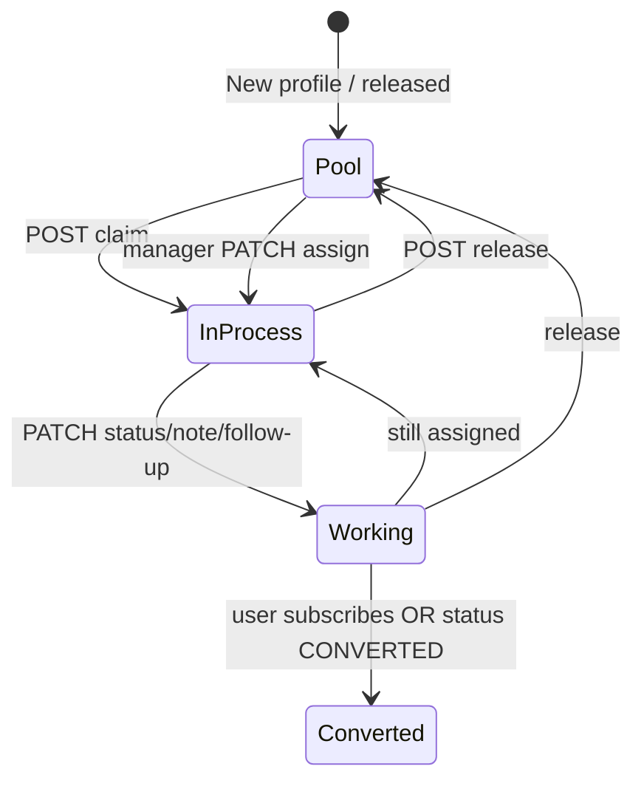

# Sales Team Frontend API Contract

Self-contained guide for the **standalone sales dashboard** (sales employees). The main admin panel contract is in [`FRONTEND_ADMIN_API_CONTRACT.md`](./FRONTEND_ADMIN_API_CONTRACT.md) (analytics, users, reports, staff CRUD). This document covers everything the sales SPA needs.

---

## Table of contents

1. [Quick start](#1-quick-start)
2. [Environment & HTTP conventions](#2-environment--http-conventions)
3. [Authentication](#3-authentication)
4. [Errors & HTTP status codes](#4-errors--http-status-codes)
5. [Pagination & dates](#5-pagination--dates)
6. [Enums & field reference](#6-enums--field-reference)
7. [Lead workflow (UI state machine)](#7-lead-workflow-ui-state-machine)
8. [Permissions matrix](#8-permissions-matrix)
9. [Endpoint reference](#9-endpoint-reference)
10. [Response JSON examples](#10-response-json-examples)
11. [Saved views (`filtersJson`)](#11-saved-views-filtersjson)
12. [Suggested pages → API mapping](#12-suggested-pages--api-mapping)
13. [TypeScript types](#13-typescript-types)
14. [FAQ](#14-faq)

---

## 1) Quick start

1. **Login:** `POST /api/admin/auth/login` with email + password.
2. **Store** `accessToken` and `staff.employeeId` from the response.
3. **Send on every request:** `Authorization: Bearer <accessToken>`.
4. **Pool page:** `GET /api/admin/sales/leads?pool=true&accountStatus=ACTIVE&profileStatus=APPROVED&subscribed=false`
5. **Claim:** `POST /api/admin/sales/leads/{userId}/claim` → use returned detail JSON to refresh UI (no second GET required).
6. **Work lead:** PATCH status / note / follow-up on the same `userId`.
7. **Release (optional):** `POST .../release` to return lead to the shared pool.

**Do not use** `POST /api/admin/auth/token` + `X-Admin-Secret` in the sales SPA — that bootstrap flow is for internal super-admin tooling only.

---

## 2) Environment & HTTP conventions

| Item | Value |
|------|--------|
| API prefix | `/api/admin` |
| Sales routes | `/api/admin/sales/**` |
| Content-Type (POST/PATCH bodies) | `application/json` |
| Auth header | `Authorization: Bearer <accessToken>` |
| Timestamps | ISO-8601 **UTC** instants, e.g. `2026-06-27T10:30:00.000Z` |
| Enum query params | Uppercase Java enum names: `APPROVED`, `ACTIVE`, `INTERESTED`, … |
| Default list page | `page=0`, `size=20` (max `size=100`) |

### CORS & ngrok (local dev)

When the browser calls your backend directly (no nginx):

- Enable Spring CORS: `app.admin.cors.enabled=true` and set `app.admin.cors.allowed-origins` (e.g. `http://localhost:5173`).
- On **ngrok free** hosts, send header **`ngrok-skip-browser-warning: true`** on **every** API call from the browser, or ngrok may return HTML and the browser will show a CORS error.

See §0 in [`FRONTEND_ADMIN_API_CONTRACT.md`](./FRONTEND_ADMIN_API_CONTRACT.md) for production CORS notes.

---

## 3) Authentication

### Login

```http
POST /api/admin/auth/login
Content-Type: application/json

{
  "email": "sales1@qalbi.co.in",
  "password": "your-password"
}
```

### Login response (`AdminStaffLoginResponse`)

```json
{
  "accessToken": "eyJ...",
  "expiresAt": "2026-06-28T10:00:00.000Z",
  "scope": "admin_access",
  "roles": ["ROLE_ADMIN", "ROLE_SALES_AGENT"],
  "sessionId": "admin-staff-uuid",
  "staff": {
    "id": "mongo-object-id",
    "employeeId": "SALES001",
    "name": "Sales Agent 1",
    "email": "sales1@qalbi.co.in",
    "phone": null,
    "role": "SALES_AGENT",
    "status": "ACTIVE",
    "createdAt": "2026-01-01T00:00:00.000Z",
    "updatedAt": "2026-06-01T00:00:00.000Z",
    "lastLoginAt": "2026-06-27T09:00:00.000Z"
  }
}
```

### What to store client-side

| Field | Use |
|-------|-----|
| `accessToken` | Bearer token on all requests |
| `expiresAt` | Optional proactive re-login before expiry |
| `staff.employeeId` | Display “My ID”, pass as `adminUserId` on notes, compare with `assignedToAdminId` |
| `staff.role` | Show/hide manager UI (assign, staff list, all-agent performance) |
| `roles` | Must include `ROLE_ADMIN` for any admin route |

- JWT **`sub`** (subject) = staff **`employeeId`** (e.g. `SALES001`). Same value used for `assignedToMe` and lead assignment.
- Invalid credentials → **400** `"Invalid email or password"`.
- Disabled staff → cannot login.

### Token expiry

- **401** on any route → clear session, redirect to login, do **not** treat as “wrong password” on the login form.
- **403** → valid token but forbidden action (e.g. editing another agent’s lead). Show “Not allowed”, do not logout.

---

## 4) Errors & HTTP status codes

Most failures return JSON (`ErrorResponse`):

```json
{
  "timestamp": "2026-06-27T12:00:00.123Z",
  "status": 400,
  "error": "Bad Request",
  "message": "outcomeReason is required for status NOT_INTERESTED"
}
```

| HTTP | When | Frontend action |
|------|------|-----------------|
| **400** | Validation, unknown user, bad enum | Show `message` |
| **401** | Missing/expired token | Logout → login |
| **403** | Wrong role or not your lead | Show forbidden state |
| **404** | Rare on sales paths | Show not found |
| **409** | Claim conflict — another agent holds the lead | Toast: “Already taken”, refresh pool row |
| **500** | Server error | Generic error + retry |

Validation **400** responses may concatenate multiple field errors into one `message` string.

---

## 5) Pagination & dates

### List responses

All paginated sales list endpoints share:

```json
{
  "items": [ /* ... */ ],
  "page": 0,
  "size": 20,
  "total": 1542
}
```

- **`page`**: zero-based index.
- **`total`**: **global** count matching **all** active filters (not just the current page).
- Empty result: `"items": []`, `"total": 0` — still **200**.

### Date ranges

| Param | Semantics |
|-------|-----------|
| `start` | Profile `createdAt` **≥ start** (inclusive) |
| `end` | Profile `createdAt` **< end** (exclusive) |
| `followUpStart` / `followUpEnd` | Lead `followUpAt` in **`[followUpStart, followUpEnd)`**; leads **without** `followUpAt` are **excluded** when either bound is set |

Send UTC instants from the UI (date pickers → start-of-day UTC) to avoid off-by-one-day bugs.

---

## 6) Enums & field reference

### `AdminSalesStatus` (lead pipeline)

| Value | Meaning | UI notes |
|-------|---------|----------|
| `CALL_REMAINING` | In pool, not actively worked | Default when no lead row exists |
| `IN_PROCESS` | Claimed / assigned, being worked | Set automatically on **claim** |
| `ALREADY_CALLED` | Call completed | Auto-sets `lastCalledAt` if omitted |
| `CALL_NOT_PICKED` | No answer | Requires **`outcomeReason`**; auto-sets `lastCalledAt` |
| `CALL_BACK_LATER` | Schedule follow-up | Pair with follow-up date |
| `INTERESTED` | Positive outcome | |
| `NOT_INTERESTED` | Closed negative | Requires **`outcomeReason`** |
| `CONVERTED` | User subscribed | Also set automatically when profile becomes subscribed |

Filter param `status`: omit, blank, or **`ALL`** = no status filter. Otherwise send exact enum name (case-insensitive).

### `AdminSalesOutcomeReason` (required for `NOT_INTERESTED` and `CALL_NOT_PICKED`)

`PRICE_ISSUE`, `NOT_LOOKING_NOW`, `WRONG_NUMBER`, `NO_RESPONSE`, `ALREADY_MARRIED`, `COMPETITOR`, `LANGUAGE_BARRIER`, `OTHER`

Show a dropdown when status is one of those two; block submit until selected.

### `AdminSalesActivityType` (timeline filter `type=`)

`CLAIMED`, `RELEASED`, `STATUS_CHANGED`, `NOTE_ADDED`, `FOLLOW_UP_SET`, `WHATSAPP_SENT`, `CONVERTED`, `ASSIGNED`

### Profile filters

| Param | Enum / type | Values |
|-------|-------------|--------|
| `profileStatus` | `ProfileStatus` | `APPROVED`, `PENDING`, `REJECTED` |
| `accountStatus` | `AccountStatus` | `ACTIVE`, `DELETED`, `BANNED` |
| `gender` | string | Exact match on stored value, e.g. `Male`, `Female` |
| `maritalStatus` | string | Exact match, e.g. `Never married` — **URL-encode spaces** |
| `state`, `city` | string | Exact match after trim — **URL-encode spaces** |
| `birthYear` | int | 1900–2100; invalid → **400** |
| `subscribed` | boolean | `true` / `false` |
| `verifiedProfile` | boolean | `true` / `false` |

**Recommended pool defaults:** `accountStatus=ACTIVE`, `profileStatus=APPROVED`, `subscribed=false`.

### `leadScore`

Integer **0–100** priority hint on list rows. Higher = call sooner. With `sort=leadScore`, ordering is applied **within the current page only** (global sort is by profile `createdAt` desc, then re-sorted by score in memory).

### Stale claims

Config: `admin.sales.claim-stale-minutes=120` (default **120 minutes**).

If a lead is `IN_PROCESS` and `updatedAt` is older than this threshold, it appears in **`pool=true`** again and another agent may **claim** (409 only while actively held).

---

## 7) Lead workflow (UI state machine)



### Button visibility (per row / detail)

| Condition | Show |
|-----------|------|
| Lead is pool-eligible (`pool=true` row OR detail: unassigned / stale `IN_PROCESS`) | **Claim** |
| `assignedToAdminId === my employeeId` OR manager+ | **Release**, status dropdown, note, follow-up, WhatsApp log |
| `assignedToAdminId` is another agent (not stale) | Read-only preview only (detail **403** on write) |
| Manager+ | **Assign** dropdown (staff list) |

**Claim** returns full **`AdminSalesLeadDetailResponse`** — bind UI from that response.

All PATCH/POST write endpoints on a lead (status, note, follow-up, communication, claim, release) return **`AdminSalesLeadDetailResponse`** — refresh detail state from the response body.

---

## 8) Permissions matrix

| Role | List (`GET /leads`) | Detail read | Claim | Release | Status/note/follow-up | Assign | Staff CRUD |
|------|---------------------|-------------|-------|---------|----------------------|--------|------------|
| `SALES_AGENT` | Use **`pool=true`** or **`assignedToMe=true`** (no server auto-scope) | Pool + own assigned | Yes | Own only | Own assigned only | No | No |
| `SALES_MANAGER` | All filters | All | Yes | All | All | Yes | Yes |
| `SUPER_ADMIN` | All | All | Yes | All | All | Yes | Yes |
| `SUPPORT` | All (read) | All (read) | No | No | No | No | No |

**Important for agents:** the list API does **not** automatically restrict to “my leads”. Always pass **`pool=true`** on the pool page and **`assignedToMe=true`** on “My leads”. Opening detail for a non-pool, non-assigned lead returns **403**.

---

## 9) Endpoint reference

Base: **`/api/admin/sales`**. All require `Authorization: Bearer …` unless noted.

### A) List leads

`GET /leads`

| Param | Description |
|-------|-------------|
| `pool=true` | Claimable leads only (unassigned `CALL_REMAINING`, no lead row, or stale `IN_PROCESS`) |
| `assignedToMe=true` | `assignedToAdminId` = logged-in `employeeId` |
| `assignedToAdminId` | Staff `employeeId`, or literal **`UNASSIGNED`** |
| `status` | `AdminSalesStatus` or `ALL` |
| `start`, `end` | Profile signup range |
| `followUpStart`, `followUpEnd` | Follow-up window |
| `query` | Search userId, memberId, phone, fullName (case-insensitive contains) |
| Profile filters | See §6 |
| `sort=leadScore` | Page-local score sort |
| `page`, `size` | Pagination |

**Response:** `AdminSalesLeadSearchResponse`

### B) Lead detail

`GET /leads/{userId}` → `AdminSalesLeadDetailResponse` (full nested `profile` — same tree as admin user detail; see admin doc §2.3).

### C) Claim / release

| Method | Path | Body | Response | Errors |
|--------|------|------|----------|--------|
| `POST` | `/leads/{userId}/claim` | none | Detail | **409** if taken |
| `POST` | `/leads/{userId}/release` | none | Detail | **403** if not assignee/manager |

Claim sets: `status=IN_PROCESS`, `assignedToAdminId=you`, `claimedAt=now`.

Release sets: `status=CALL_REMAINING`, clears assignee and `claimedAt`.

### D) Update status

`PATCH /leads/{userId}/status`

```json
{
  "status": "NOT_INTERESTED",
  "outcomeReason": "PRICE_ISSUE",
  "lastCalledAt": "2026-06-27T10:00:00.000Z"
}
```

| Field | Required | Notes |
|-------|----------|-------|
| `status` | Yes | `AdminSalesStatus` |
| `outcomeReason` | When status is `NOT_INTERESTED` or `CALL_NOT_PICKED` | Else omit or null (cleared server-side) |
| `lastCalledAt` | No | If omitted and status is `ALREADY_CALLED` or `CALL_NOT_PICKED`, server sets to **now** |

### E) Update note

`PATCH /leads/{userId}/note`

```json
{
  "note": "Interested in premium plan.",
  "adminUserId": "SALES001"
}
```

- `note`: required, non-blank.
- `adminUserId`: stored on history entry — use **`staff.employeeId`** from login (not email).

Appends to `notes[]`; `note` field holds latest text.

### F) Update follow-up

`PATCH /leads/{userId}/follow-up`

```json
{ "followUpAt": "2026-06-28T14:00:00.000Z" }
```

Send `{ "followUpAt": null }` or `{}` to **clear** follow-up.

### G) Assign (managers only)

`PATCH /leads/{userId}/assign`

```json
{ "assignedToAdminId": "SALES002" }
```

`null` or omit to unassign → back to pool (`CALL_REMAINING`).

### H) Follow-up queues

`GET /follow-ups?bucket=due_today|overdue|upcoming&assignedToMe=true&page=0&size=20`

Same list row shape as `GET /leads`. Buckets use **UTC calendar days**:

| `bucket` | `followUpAt` range |
|----------|-------------------|
| `due_today` (default) | `[today 00:00 UTC, tomorrow 00:00 UTC)` |
| `overdue` | `< today 00:00 UTC` |
| `upcoming` | `[tomorrow 00:00 UTC, today+7 days 00:00 UTC)` |

Optional `assignedToMe=true` limits to your assigned leads.

### I) Activity timeline

`GET /leads/{userId}/activities?type=STATUS_CHANGED&page=0&size=20`

**Response:** `AdminSalesActivitySearchResponse`

### J) Communications (WhatsApp log)

| Method | Path | Notes |
|--------|------|-------|
| `GET` | `/leads/{userId}/communications` | Same as activities filtered to `WHATSAPP_SENT` |
| `POST` | `/leads/{userId}/communications` | Body below |

```json
{
  "channel": "WHATSAPP",
  "templateName": "intro_v1",
  "note": "Sent plan details"
}
```

- `channel`: **required** (non-blank). Use **`WHATSAPP`** for WhatsApp entries.
- `templateName`, `note`: optional.

Returns updated lead **detail** (not activity list).

### K) Conversions

`GET /conversions?start=&end=&assignedToAdminId=&page=0&size=20`

Subscribed profiles with sales assignee metadata.

**Response:** `AdminSalesConversionSearchResponse`

### L) Agent performance

`GET /agents/performance?start=&end=&employeeId=`

| Caller | `employeeId` |
|--------|----------------|
| `SALES_AGENT` | Omit or `self` → **only your row** |
| Manager+ | Omit → all sales staff; or filter one `employeeId` |

**Response:** `AdminSalesAgentPerformanceResponse`

### M) Saved views

| Method | Path | Body / notes |
|--------|------|--------------|
| `POST` | `/saved-views` | `{ "name", "filtersJson" }` — both required |
| `GET` | `/saved-views` | Agents: own views only. Managers: optional `employeeId` filter |
| `PATCH` | `/saved-views/{viewId}` | Optional `name`, `filtersJson` |
| `DELETE` | `/saved-views/{viewId}` | Empty body; **204**-style void |

### N) Summary metrics

`GET /summary?start=&end=`

**Response:** `AdminMetricsResponse` — card `key` examples:

| `key` | Meaning |
|-------|---------|
| `sales_total_leads` | Profiles created in range |
| `sales_call_remaining` | Count by status |
| `sales_in_process` | |
| `sales_already_called` | |
| `sales_call_not_picked` | |
| `sales_call_back_later` | |
| `sales_interested` | |
| `sales_not_interested` | |
| `sales_converted` | |
| `sales_follow_up_due_today` | UTC today |
| `sales_follow_up_overdue` | Before UTC today |

(One card per `AdminSalesStatus` — keys are `sales_` + lowercase status name.)

---

## 10) Response JSON examples

### List row (`AdminSalesLeadSummary`)

```json
{
  "userId": "user-abc-123",
  "memberId": "M10042",
  "phone": "+919876543210",
  "fullName": "Priya Sharma",
  "gender": "Female",
  "city": "Lucknow",
  "state": "Uttar Pradesh",
  "country": "India",
  "createdAt": "2026-06-20T08:15:00.000Z",
  "profileStatus": "APPROVED",
  "accountStatus": "ACTIVE",
  "subscribed": false,
  "salesStatus": "CALL_REMAINING",
  "note": null,
  "followUpAt": null,
  "lastCalledAt": null,
  "assignedToAdminId": null,
  "claimedAt": null,
  "outcomeReason": null,
  "convertedAt": null,
  "leadScore": 68,
  "updatedAt": null
}
```

### Lead detail (sales fields — `profile` omitted)

```json
{
  "otpVerified": true,
  "profileRegistered": true,
  "signupAt": "2026-06-20T08:10:00.000Z",
  "otpVerifiedAt": "2026-06-20T08:12:00.000Z",
  "lastLoginAt": "2026-06-26T18:00:00.000Z",
  "lastActivityAt": "2026-06-26T18:05:00.000Z",
  "reportsAgainstUser": 0,
  "blocksByUser": 1,
  "blocksAgainstUser": 0,
  "activeMatches": 2,
  "initiatedChats": 3,
  "interactionsSent": 12,
  "salesStatus": "IN_PROCESS",
  "note": "Call back evening",
  "notes": [
    {
      "text": "First contact attempt",
      "adminUserId": "SALES001",
      "createdAt": "2026-06-27T09:00:00.000Z"
    }
  ],
  "followUpAt": "2026-06-28T14:00:00.000Z",
  "lastCalledAt": "2026-06-27T09:30:00.000Z",
  "assignedToAdminId": "SALES001",
  "claimedAt": "2026-06-27T09:00:00.000Z",
  "outcomeReason": null,
  "convertedAt": null,
  "leadScore": 72,
  "salesCreatedAt": "2026-06-27T09:00:00.000Z",
  "salesUpdatedAt": "2026-06-27T09:30:00.000Z"
}
```

### Activity entry

```json
{
  "id": "activity-id",
  "userId": "user-abc-123",
  "type": "STATUS_CHANGED",
  "message": "Status changed to INTERESTED",
  "metadata": { "from": "IN_PROCESS", "to": "INTERESTED" },
  "actorEmployeeId": "SALES001",
  "createdAt": "2026-06-27T10:00:00.000Z"
}
```

### Conversion row

```json
{
  "userId": "user-abc-123",
  "memberId": "M10042",
  "fullName": "Priya Sharma",
  "phone": "+919876543210",
  "assignedToAdminId": "SALES001",
  "convertedAt": "2026-06-28T11:00:00.000Z",
  "subscribedAt": "2026-06-20T08:15:00.000Z"
}
```

### Agent performance row

```json
{
  "employeeId": "SALES001",
  "name": "Sales Agent 1",
  "claimedCount": 45,
  "callsCount": 38,
  "interestedCount": 12,
  "convertedCount": 3,
  "overdueFollowUps": 2,
  "avgMinutesToFirstCall": 18.5
}
```

`avgMinutesToFirstCall` may be JSON **`null`** when no qualifying leads exist.

### Saved view

```json
{
  "id": "view-mongo-id",
  "ownerEmployeeId": "SALES001",
  "name": "Approved unsubscribed UP",
  "filtersJson": "{\"pool\":true,\"state\":\"Uttar Pradesh\",\"subscribed\":false,\"profileStatus\":\"APPROVED\"}",
  "createdAt": "2026-06-01T00:00:00.000Z",
  "updatedAt": "2026-06-27T08:00:00.000Z"
}
```

---

## 11) Saved views (`filtersJson`)

`filtersJson` is a **string** containing serialized JSON of the same keys as `GET /leads` query params (boolean/number/string values).

**Example object** (before stringifying):

```json
{
  "pool": true,
  "assignedToMe": false,
  "state": "Uttar Pradesh",
  "city": "Lucknow",
  "subscribed": false,
  "profileStatus": "APPROVED",
  "accountStatus": "ACTIVE",
  "status": "ALL",
  "birthYear": 1995,
  "sort": "leadScore",
  "size": 50
}
```

**Frontend flow:**

1. User sets filters on pool page.
2. `POST /saved-views` with `name` + `JSON.stringify(filters)`.
3. On load, `GET /saved-views` → parse `filtersJson` → apply to list query builder.
4. `PATCH` to rename or update filters; `DELETE` to remove.

Views are scoped to **`ownerEmployeeId`** (your `employeeId`). Managers can list another agent’s views with `?employeeId=SALES001`.

---

## 12) Suggested pages → API mapping

| Page | APIs | UI notes |
|------|------|----------|
| **Login** | `POST /auth/login` | Store token + `staff` |
| **Dashboard** | `GET /summary` | Metric cards from `metrics[].key` |
| **Pool** | `GET /leads?pool=true…`, saved views, `POST …/claim` | Claim per row; handle **409** |
| **My leads** | `GET /leads?assignedToMe=true` | Release, status actions |
| **Follow-ups** | `GET /follow-ups?bucket=…&assignedToMe=true` | Three tabs: due / overdue / upcoming |
| **Lead detail** | `GET …/leads/{id}`, `…/activities`, `…/communications`, PATCH endpoints | Single detail state from PATCH responses |
| **Conversions** | `GET /conversions` | Manager filter by `assignedToAdminId` |
| **Performance** | `GET /agents/performance?employeeId=self` | Agents: self only |
| **Assign** (manager) | `PATCH …/assign`, `GET /staff?role=SALES_AGENT` | Pick active assignee |

### Out of scope for sales SPA

- `/api/admin/analytics/**`
- `/api/admin/users/**` (except profile embedded in sales detail)
- `/api/admin/reports/**`
- `/api/admin/staff/**` except manager assignee picker

---

## 13) TypeScript types

Copy into the sales frontend repo. `IsoInstant` = ISO-8601 string from JSON.

```ts
export type IsoInstant = string;

export interface ErrorResponse {
  timestamp: IsoInstant;
  status: number;
  error: string;
  message: string;
}

export type AdminStaffRole = "SUPER_ADMIN" | "SALES_MANAGER" | "SALES_AGENT" | "SUPPORT";
export type AdminStaffStatus = "ACTIVE" | "DISABLED";

export interface AdminStaffSummary {
  id: string;
  employeeId: string;
  name: string;
  email: string;
  phone: string | null;
  role: AdminStaffRole;
  status: AdminStaffStatus;
  createdAt: IsoInstant | null;
  updatedAt: IsoInstant | null;
  lastLoginAt: IsoInstant | null;
}

export interface AdminStaffLoginResponse {
  accessToken: string;
  expiresAt: IsoInstant;
  scope: string;
  roles: string[];
  sessionId: string;
  staff: AdminStaffSummary;
}

export type AdminSalesStatus =
  | "CALL_REMAINING" | "IN_PROCESS" | "ALREADY_CALLED" | "CALL_NOT_PICKED"
  | "CALL_BACK_LATER" | "INTERESTED" | "NOT_INTERESTED" | "CONVERTED";

export type AdminSalesOutcomeReason =
  | "PRICE_ISSUE" | "NOT_LOOKING_NOW" | "WRONG_NUMBER" | "NO_RESPONSE"
  | "ALREADY_MARRIED" | "COMPETITOR" | "LANGUAGE_BARRIER" | "OTHER";

export type AdminSalesActivityType =
  | "CLAIMED" | "RELEASED" | "STATUS_CHANGED" | "NOTE_ADDED" | "FOLLOW_UP_SET"
  | "WHATSAPP_SENT" | "CONVERTED" | "ASSIGNED";

export type ProfileStatus = "APPROVED" | "PENDING" | "REJECTED";
export type AccountStatus = "ACTIVE" | "DELETED" | "BANNED";

export interface SalesLeadsFilters {
  start?: IsoInstant;
  end?: IsoInstant;
  status?: AdminSalesStatus | "ALL";
  followUpStart?: IsoInstant;
  followUpEnd?: IsoInstant;
  query?: string;
  profileStatus?: ProfileStatus;
  accountStatus?: AccountStatus;
  gender?: string;
  subscribed?: boolean;
  verifiedProfile?: boolean;
  birthYear?: number;
  maritalStatus?: string;
  state?: string;
  city?: string;
  pool?: boolean;
  assignedToAdminId?: string;
  assignedToMe?: boolean;
  sort?: "leadScore";
  page?: number;
  size?: number;
}

export interface AdminSalesLeadSummary {
  userId: string;
  memberId: string | null;
  phone: string | null;
  fullName: string | null;
  gender: string | null;
  city: string | null;
  state: string | null;
  country: string | null;
  createdAt: IsoInstant | null;
  profileStatus: string | null;
  accountStatus: string | null;
  subscribed: boolean;
  salesStatus: string;
  note: string | null;
  followUpAt: IsoInstant | null;
  lastCalledAt: IsoInstant | null;
  assignedToAdminId: string | null;
  claimedAt: IsoInstant | null;
  outcomeReason: AdminSalesOutcomeReason | null;
  convertedAt: IsoInstant | null;
  leadScore: number;
  updatedAt: IsoInstant | null;
}

export interface AdminSalesLeadSearchResponse {
  items: AdminSalesLeadSummary[];
  page: number;
  size: number;
  total: number;
}

export interface AdminSalesNoteEntry {
  text: string;
  adminUserId: string | null;
  createdAt: IsoInstant;
}

export interface AdminSalesLeadDetailResponse {
  profile: Record<string, unknown>; // see admin doc UserProfile
  otpVerified: boolean;
  profileRegistered: boolean;
  signupAt: IsoInstant | null;
  otpVerifiedAt: IsoInstant | null;
  lastLoginAt: IsoInstant | null;
  lastActivityAt: IsoInstant | null;
  reportsAgainstUser: number;
  blocksByUser: number;
  blocksAgainstUser: number;
  activeMatches: number;
  initiatedChats: number;
  interactionsSent: number;
  salesStatus: string;
  note: string | null;
  notes: AdminSalesNoteEntry[];
  followUpAt: IsoInstant | null;
  lastCalledAt: IsoInstant | null;
  assignedToAdminId: string | null;
  claimedAt: IsoInstant | null;
  outcomeReason: AdminSalesOutcomeReason | null;
  convertedAt: IsoInstant | null;
  leadScore: number;
  salesCreatedAt: IsoInstant | null;
  salesUpdatedAt: IsoInstant | null;
}

export interface UpdateSalesStatusRequest {
  status: AdminSalesStatus;
  lastCalledAt?: IsoInstant | null;
  outcomeReason?: AdminSalesOutcomeReason | null;
}

export interface UpdateSalesNoteRequest {
  note: string;
  adminUserId: string | null;
}

export interface UpdateSalesFollowUpRequest {
  followUpAt?: IsoInstant | null;
}

export interface CreateAdminSalesCommunicationRequest {
  channel: string;
  templateName?: string | null;
  note?: string | null;
}

export interface AdminSalesActivityEntry {
  id: string;
  userId: string;
  type: AdminSalesActivityType;
  message: string;
  metadata: Record<string, unknown>;
  actorEmployeeId: string | null;
  createdAt: IsoInstant;
}

export interface AdminSalesActivitySearchResponse {
  items: AdminSalesActivityEntry[];
  page: number;
  size: number;
  total: number;
}

export interface AdminSalesConversionSummary {
  userId: string;
  memberId: string | null;
  fullName: string | null;
  phone: string | null;
  assignedToAdminId: string | null;
  convertedAt: IsoInstant | null;
  subscribedAt: IsoInstant | null;
}

export interface AdminSalesConversionSearchResponse {
  items: AdminSalesConversionSummary[];
  page: number;
  size: number;
  total: number;
}

export interface AdminSalesAgentPerformance {
  employeeId: string;
  name: string;
  claimedCount: number;
  callsCount: number;
  interestedCount: number;
  convertedCount: number;
  overdueFollowUps: number;
  avgMinutesToFirstCall: number | null;
}

export interface AdminSalesAgentPerformanceResponse {
  items: AdminSalesAgentPerformance[];
}

export interface AdminSalesSavedViewSummary {
  id: string;
  ownerEmployeeId: string;
  name: string;
  filtersJson: string;
  createdAt: IsoInstant;
  updatedAt: IsoInstant;
}

export interface AdminSalesSavedViewSearchResponse {
  items: AdminSalesSavedViewSummary[];
  page: number;
  size: number;
  total: number;
}

export interface CreateAdminSalesSavedViewRequest {
  name: string;
  filtersJson: string;
}

export interface UpdateAdminSalesSavedViewRequest {
  name?: string;
  filtersJson?: string;
}

export interface AssignSalesLeadRequest {
  assignedToAdminId?: string | null;
}

export interface AdminMetricCard {
  key: string;
  total: number;
  series: { bucket: string; value: number }[];
  breakdown: { key: string; value: number }[];
}

export interface AdminMetricsResponse {
  start: IsoInstant;
  end: IsoInstant;
  granularity: "DAILY" | "WEEKLY" | "MONTHLY";
  metrics: AdminMetricCard[];
}
```

---

## 14) FAQ

**Q: Can I combine `pool=true` and `assignedToMe=true`?**  
A: Yes — both filters apply (AND). Usually use one or the other per page.

**Q: Why does list show leads I cannot open?**  
A: Agents should not call `GET /leads` without `pool` or `assignedToMe`. Detail enforces access; list does not auto-scope for agents.

**Q: Do I need a second GET after PATCH status?**  
A: No — PATCH returns full `AdminSalesLeadDetailResponse`.

**Q: What happens when user subscribes in the app?**  
A: Backend may auto-set `CONVERTED` on next read/write; show converted state from detail fields.

**Q: 409 on claim — what next?**  
A: Remove row from pool or refresh list; another agent claimed it (or stale window not yet elapsed).

**Q: Which statuses need outcome reason?**  
A: Only `NOT_INTERESTED` and `CALL_NOT_PICKED`. Server returns **400** if missing.

**Q: How to clear follow-up?**  
A: `PATCH …/follow-up` with `{ "followUpAt": null }`.

**Q: Where is full `UserProfile` documented?**  
A: [`FRONTEND_ADMIN_API_CONTRACT.md`](./FRONTEND_ADMIN_API_CONTRACT.md) §2.3 — nested under `profile` on lead detail.
